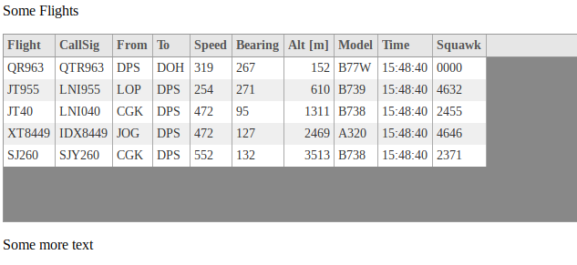
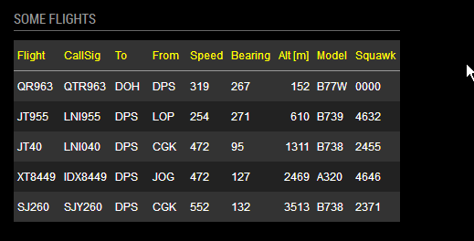

## MagicMirror Module: Tabulator


| STATUS: | Version | Date | Maintained? |
|:------- |:------- |:---- |:----------- |
| Working | `1.0.2` | 2018-03-05 | YES |


**What is this module doing?**

`MMM-Tabulator` is just a demonstration module for using the [Tabulator](http://tabulator.info/) *npm* package on your [MagicMirror](https://github.com/MichMich/MagicMirror). 
*Tabulator* is a very nice tool for producing dynamic HTML tables from various sources, like JSON, CSV and XML etc. 
However, although very well documented, the [examples](http://tabulator.info/examples/) are very hard to understand and implement in practice, 
for non-experts. 


**Why I should use Tabulator?**

* Very flexible for manipulating all aspects of table data
* Can sort table columns in several ways and in multiple stages
* Can use graphics in tables
* Can easily enable/disable various table items
* Help reduce all the clutter of HTML generating JS code
* You never have to write DOM code again!
* You don't need to think about converting XML or JSON to HTML table
* Very well used and maintained repository


**Why I should not use Tabulator for my MM:**

* It is totally overkill for showing small and simple tables
* It is a very large library, easily bloating your MMs if used repeatedly
* It is definitely slowing down load times somewhat
* It is dependent on:  *jquery* and *jqeuery-ui*. 


### Example Screenshots

In this repo there are 2 demo examples.

1. The `demo.html` file, that has the JSON embedded and can be run directly from your browser.
2. The `MMM-Tabulator` Module, that is importing the same JSON data from the file `demo.json`.

Screenshot of the `demo.html` output:



Screenshot of the `MMM-Tabulator` output:




The flight JSON data shown, was provided by [FlightRadar24](https://www.flightradar24.com/). 

---


### Dependencies

This module depend on the following *npm* packages:

* [jquery](https://github.com/jquery/jquery)  - is a fast, small, and feature-rich JavaScript library
* [jquery-ui](https://github.com/jquery/jquery-ui)  - for user interface interactions, effects, widgets, and themes
* [tabulator](https://github.com/olifolkerd/tabulator) - for an overkill use of JSON to HTML table generation


These are also listed in the `package.json` file and should be installed automatically when using *npm*.
However, those may require other packages. 

---


### Installation

Manual Installation:

```bash
cd ~/MagicMirror/modules
git clone https://github.com/E3V3A/MMM-Tabulator.git
cd MMM-Tabulator

# To locally install: jquery, jquery-ui and tabulator, do:
chmod 755 install_deps.sh
./install_deps.sh

# ToDo:
#npm install
```

Easy Installation [**ToDo**]:


```bash
npm install mmm-tabulator
```

### Configuration 

To configure the Tabulator for MM, you need to do the following:

* Add the Module to the global MM *config.js* 
* Edit `node_helper.js` to select the correct JSON file or JSON input file:  

   `const myfile = 'modules/MMM-Tabulator/demo.json';`

* Edit `MMM-Tabulator.js` to:
    - select & configure the table rows you want to show
    - edit the column formatting to be used
    - [TBA] select the filename or URL from where to load the JSON data
    - select the default Tabulator CSS
* Edit `MMM-Tabulator.css` for your own CSS taste

Add the module to the modules array in the `config/config.js` file by adding the following section. 

```javascript
{
    module: 'MMM-Tabulator',
    header: 'Tabulator Demo',
    position: 'top_left',
    config: {
        //fileUrl: "demo.json",     // The local filename or URL to JSON source
        updateInterval: 180,        // [seconds] Read the file every 3 min
        maxItems: 10,               // Max table rows shown
    }
},
...
```

You can change this configuration later when you see that it works.


#### Configuration Options


| Option         | Default          | Description |
|:-------------- |:---------------- |:------------| 
| header         | "Tabulator Demo" | This Module's header text |
| updateInterval | 180              | Module data update in [seconds] |
| maxItems       | 10               | Number of table rows to show |
| fileUrl*       | "demo.json"      | A local filename or URL to a JSON API |

`*` - **not yet implemented - ToDo!**

---

#### `Tabulator` configuration

The main part to configure is found under the `loadTabulator()` function:

```javascript
...
    flightTable.tabulator({
        height:flightTableHeight,           // Set height of table, this enables the Virtual DOM and improves render speed
        //layout:"fitColumns",                // Fit columns to width of table (optional)
        //headerSort:false,                   // Disable header sorter
        resizableColumns:false,             // Disable column resize
        responsiveLayout:true,              // Enable responsive layouts
        placeholder:"No Data Available",    // Display message to user on empty table
        initialSort:[                       // Define the sort order:
            {column:"altitude",     dir:"asc"},     // 1'st
            //{column:"flight",     dir:"desc"},    // 2'nd
            //{column:"bearing",    dir:"asc"},     // 3'rd
        ],
        columns:[
            ...
            {title:"Time", field:"timestamp", headerSort:false, sortable:false, visible:false, responsive:1, formatter:"ep2time"},
...

```


For further details about configuring the many Tabulator options, see:

* http://tabulator.info/
* https://github.com/olifolkerd/tabulator
* http://tabulator.info/docs/3.4?#css
* http://tabulator.info/examples/3.4?#theming

---

#### Bugs and Warnings

:warning: If you provide your own JSON data, other than what is provided in the `demo.json` 
file, then **it has to be in proper JSON format.** For some reason the MM socket seem to not 
accept loosely formatted JSON. There is an extremely simple JSON sanitizer, used (for my own 
purposes), but it doesn't handle any characters outside `[A-Za-z0-9_\-]`. Not sanitizing your
JSON data is a security issue that could lead to code injection! Also check if your source
is using UTF-8 or something else. 

Please refer to the [issue tracker](https://github.com/E3V3A/MMM-Tabulator/issues) for details and updates.


#### Other Modules using *Tabulator*:

* [MMM-FlightsAbove](https://github.com/E3V3A/MMM-FlightsAbove) - A flight radar showing flight & airplane details for planes above a certain location.


#### Contribution

Feel free to post issues and PR's related to this module.  
For all other or general questions, please refer to the [MagicMirror Forum](https://forum.magicmirror.builders/).

#### Credits 

Most grateful thanks to [Ray Wojciechowski](https://github.com/raywo) for sharing his 
module develpment experince and thus helping me solve all my issues. Do check out his 
many great MMM modules in his repository.


#### License 

MIT 
